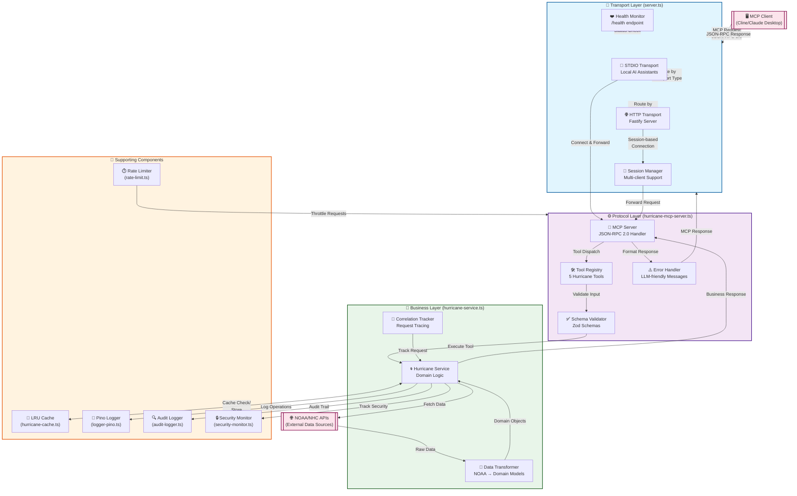
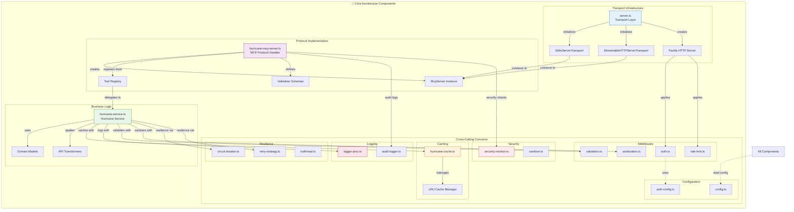
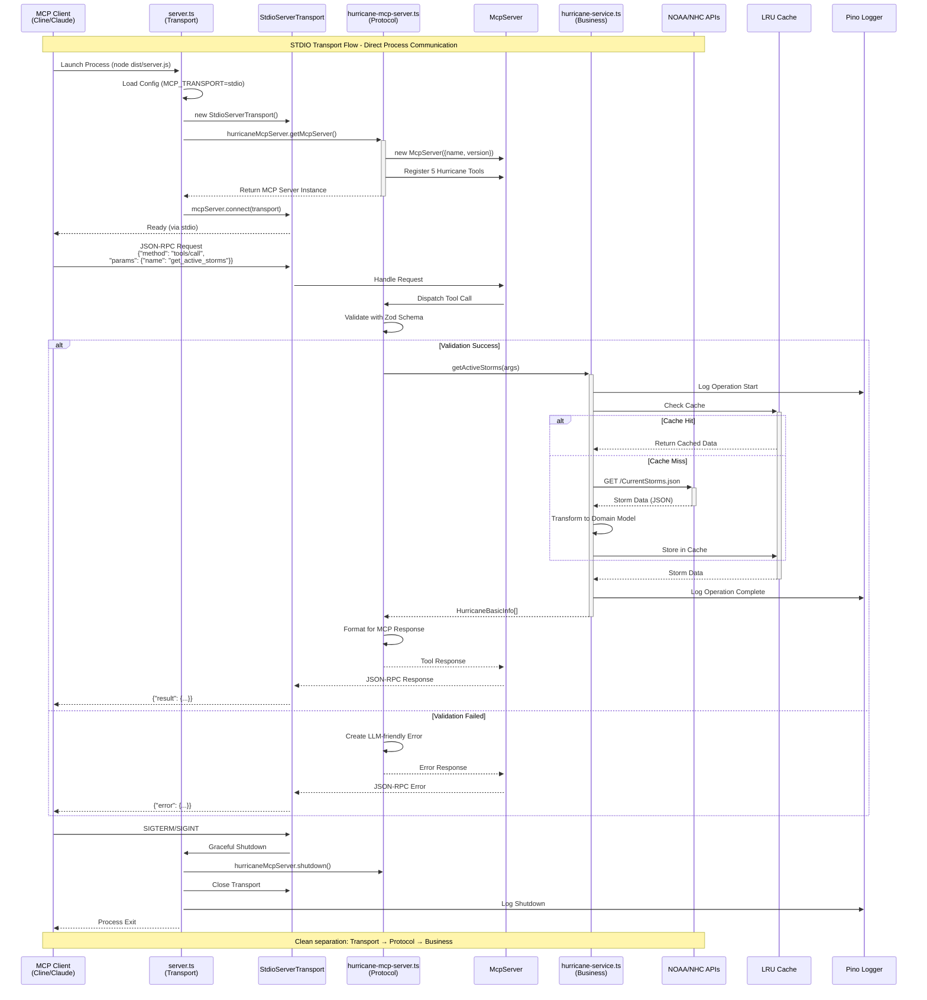
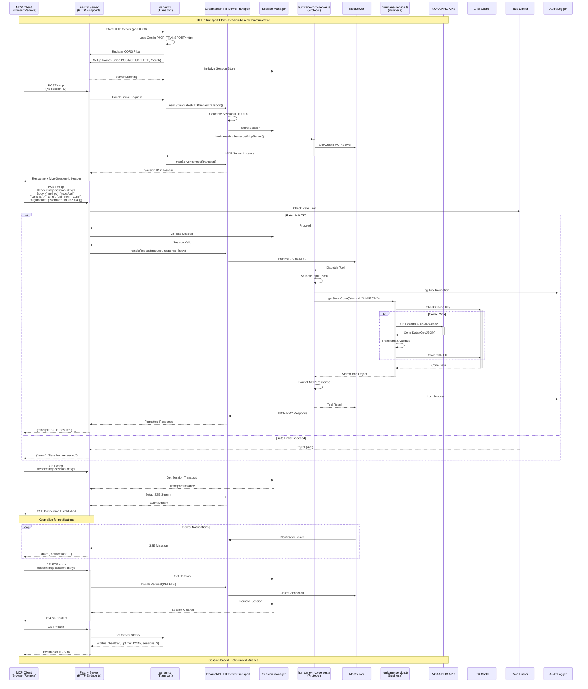

# 🌀 Hurricane Tracker MCP Server

A production-grade LLM-friendly Model Context Protocol (MCP) server that provides real-time hurricane tracking, forecast cones, local alerts, and historical storm data through MCP tools for AI assistants like Cline.

## 📑 Table of Contents

- [Quick Start](#quick-start)
  - [Prerequisites](#prerequisites)
  - [Installation & Setup](#installation--setup)
    - [Option 1: Cline AI Assistant](#option-1-cline-ai-assistant)
    - [Option 2: Claude Desktop](#option-2-claud-desktop)
  - [Test All Hurricane Tools](#test-all-hurricane-tools)
    - [Quick Test - All Capabilities](#quick-test---all-capabilities)
    - [Real-World Use Cases](#real-world-use-cases)
    - [Individual Test Scenarios](#individual-test-scenarios)
    - [Expected Real Data Behavior](#expected-real-data-behavior)
    - [Expected Results](#expected-results)
- [🌀 Available Hurricane Tools](#-available-hurricane-tools)
  - [Detailed Examples](#detailed-examples)
- [Running on Docker Container](#running-on-docker-container)
  - [Build and Run with Docker Compose](#1-build-and-run-with-docker-compose)
  - [Verify the Service is Running](#2-verify-the-service-is-running)
  - [Cline MCP Configuration for Docker](#3-cline-mcp-configuration-for-docker)
  - [Stop the Service](#4-stop-the-service)
- [🔧 Development Commands](#-development-commands)
- [📊 Expected Test Results](#-expected-test-results)
- [🏗️ Architecture](#️-architecture)
  - [📊 Data Flow Architecture](#-data-flow-architecture)
  - [🔄 Component Interaction Diagram](#-component-interaction-diagram)
  - [📋 Sequence Diagram - STDIO Transport](#-sequence-diagram---stdio-transport)
  - [📋 Sequence Diagram - Streamable HTTP Transport](#-sequence-diagram---streamable-http-transport)
  - [Perfect 3-Layer Architecture](#perfect-3-layer-architecture-gold-standard-implementation)
  - [Core Components - SOLID Implementation](#core-components---solid-implementation)
- [🤝 Contributing](#-contributing)
- [📄 License](#-license)

## Quick Start

### Prerequisites

- **Node.js 22.x** or higher
- **npm** or **yarn** package manager
- **Cline (Claude for VS Code)** or other **MCP-compatible AI assistant**

### Installation & Setup

```bash
# Clone and navigate to the project
git clone https://github.com/kumaran-is/hurricane-tracker-mcp.git
cd hurricane-tracker-mcp

# Install dependencies
npm install

# Build the project
npm run build

```

#### Option 1. Cline AI Assistant

Add the following configuration to your Cline MCP settings file (`cline_mcp_settings.json`):

```json
{
  "mcpServers": {
    "hurricane-tracker": {
      "command": "npm",
      "args": [
        "run",
        "stdio"
      ],
      "cwd": "/path/to/your/hurricane-tracker-mcp",
      "env": {
        "MCP_TRANSPORT": "stdio"
      },
      "autoApprove": [
        "get_active_storms",
        "get_storm_cone",
        "get_storm_track",
        "get_local_hurricane_alerts",
        "search_historical_tracks"
      ],
      "disabled": false,
      "timeout": 30000,
      "type": "stdio"
    }
  }
}
```

**Important**: Replace `/path/to/your/hurricane-tracker-mcp` with your actual project path.

After adding the configuration, restart Cline to load the Hurricane Tracker MCP Server.

#### Option 2. Claud Desktop

Add the following configuration to your Claude Desktop MCP settings file (`claude_desktop_config.json`):

```json
{
  "mcpServers": {
    "hurricane-tracker-mcp": {
      "command": "/path/to/your/.nvm/versions/node/v22.15.0/bin/node",
      "args": [
        "/path/to/your/hurricane-tracker-mcp/dist/server.js"
      ],
      "env": {
        "MCP_TRANSPORT": "stdio",
        "NODE_ENV": "production",
        "PRETTY_LOGS": "false",
        "LOG_LEVEL": "info"
      },
       "timeout": 30000
    }
  }
}
```

**Important**: Replace `/path/to/your/hurricane-tracker-mcp` with your actual project path.

After adding the configuration, restart Claude Desktop to load the Hurricane Tracker MCP Server.

### Test All Hurricane Tools

**Copy and paste these natural language prompts into Cline to test hurricane tracking capabilities:**

#### **Quick Test - All Capabilities:**

```bash
I'm planning a trip to the Caribbean and Gulf Coast region. Can you give me a complete hurricane safety briefing?

First, show me ALL currently active tropical storms and hurricanes globally - I want to see their names, categories, wind speeds, and current locations.

Next, check these specific cities for any hurricane warnings, watches, or tropical storm alerts:
- Miami, Florida (coordinates: 25.76, -80.19)
- New Orleans, Louisiana (29.95, -90.07)  
- Houston, Texas (29.76, -95.37)
- Cancun, Mexico (21.16, -86.85)

For any active storms you find, please show me:
- Their 5-day forecast cone and predicted path
- Where they've traveled so far (historical track)
- Which coastal areas might be impacted

Also, I'm curious about hurricane patterns - can you search for all major hurricanes (Category 3+) that passed through the Gulf of Mexico area between January 1, 2020 and December 31, 2024? The Gulf area roughly covers coordinates from -98 to -82 longitude and 18 to 31 latitude.

Finally, if there are NO active storms right now, that's useful to know too - just let me know the Atlantic is quiet.

Format the response in a clear, organized way that I can easily understand for travel planning.
```

#### **Real-World Use Cases:**

**Emergency Preparedness Check:**
```bash
My family lives along the US East Coast from Florida to North Carolina. Are there any active hurricanes or tropical storms that could affect this region in the next week? 

Check for:
- Any storms currently in the Atlantic Ocean
- Active weather alerts for major cities like Miami, Jacksonville, Charleston, and Wilmington
- If storms exist, show their predicted paths

This is for emergency preparedness planning, so please be thorough.
```

**Insurance Risk Assessment:**
```bash
I work for an insurance company and need hurricane risk data for property assessments.

Please provide:
1. All currently active storms globally with their intensities
2. Specific alerts for these high-risk areas:
   - Southern Florida (Miami-Dade County area)
   - Louisiana Gulf Coast (New Orleans region)
   - Texas Coast (Houston/Galveston area)
3. Historical data: Find all hurricanes that made landfall in the Gulf states between 2020-2024

Include storm names, peak categories, and affected areas. This helps us assess regional risk patterns.

```

**Marine Navigation Planning:**

```bash
I'm sailing from Puerto Rico to Florida next week. What's the current hurricane situation?
I need to know:
- Are there any active tropical systems in the Atlantic or Caribbean?
- What's the forecast track for any storms between Puerto Rico (18.22, -66.59) and Florida Keys (24.55, -81.78)?
- Have there been any recent storms in this corridor in the past month?

Safety is my top priority, so please check thoroughly.
```

**Scientific Research Query:**

```bash
I'm studying climate patterns and hurricane intensification. Can you help me gather data?

Please find:
1. All active tropical cyclones worldwide - separate them by ocean basin (Atlantic, Pacific, Indian)
2. For the Atlantic basin specifically, show storms in order of intensity
3. Search for historical hurricane tracks in the Caribbean Sea region (bounded by 10-25°N, 60-90°W) from 2020 to present
4. If any current storms exist with "Rapid Intensification" noted, highlight those

Present the data in a structured format suitable for research analysis.

```

**Travel Planning Assistant:**

```bash
I'm booking a vacation to Cancun for next month. Should I be worried about hurricanes?

Can you:
- Check if there are any active storms that might head toward the Yucatan Peninsula
- Look for current weather alerts for Cancun and Cozumel
- Search for historical patterns - what hurricanes hit this area in the past 5 years during the same month?
- Give me a risk assessment in plain language

I need honest advice about whether to book travel insurance.
```

**Edge Cases & Error Testing:**

```bash
Test the system's error handling with these requests:

1. Check for hurricane alerts at these unusual coordinates:
   - North Pole: latitude 90, longitude 0
   - Middle of Pacific: latitude 0, longitude -180
   - Invalid location: latitude 95, longitude 200

2. Search for historical storms with impossible dates:
   - Future dates: January 2030 to December 2035
   - Very old dates: January 1800 to December 1850

3. Request storm data for a non-existent storm ID like "XX992099"

4. Ask for the forecast cone of a storm when no storms are active

Show me how the system handles these edge cases gracefully.
```

#### **Individual Test Scenarios:**

**Test 1 - Current Storm Activity:**
```bash
What tropical storms and hurricanes are currently active around the world? I'm particularly interested in any storms in the Atlantic basin.
```

**Test 2 - Storm Forecast Information:**
```bash
Are there any active hurricanes right now? If so, I'd like to see the forecast cone showing where the storm might go over the next 5 days.
```

**Test 3 - Storm Movement History:**
```bash
Can you show me the path that any currently active hurricanes have taken so far? I want to see where they've been.
```

**Test 4 - Location-Specific Alerts:**
```bash
Please check these cities for any hurricane-related warnings or watches:
- Miami, Florida
- New Orleans, Louisiana  
- Houston, Texas
Also test what happens with invalid coordinates like latitude 95, longitude 200.
```

**Test 5 - Historical Hurricane Data:**
```bash
I'm researching hurricanes in the Gulf of Mexico. Can you find all storms that passed through the Gulf between January 2020 and December 2024? Focus on Atlantic basin storms.
```

#### **Expected Real Data Behavior:**

All tools now use **true real data patterns**:

- ✅ **Active Storms**: Calls real NOAA NHC API → returns parsed live data or empty array if API unavailable
- ✅ **Hurricane Alerts**: Calls real NWS API → returns filtered live alerts or empty array if API unavailable  
- ✅ **Historical Search**: Parses real IBTrACS CSV data → returns parsed storms or empty array if parsing fails
- ✅ **Storm Cone**: Attempts real NOAA GIS API → throws error if cone data unavailable from real sources
- ✅ **Storm Track**: Attempts real HURDAT2 database → throws error if track data unavailable from real sources

**No hardcoded fallback data** - the server returns real API responses or appropriate errors, never synthetic mock data.

#### **Expected Results:**
- ✅ **Real API responses** from NOAA/NWS/IBTrACS when available
- ✅ **Empty arrays** when APIs are temporarily unavailable (no hardcoded fallbacks)
- ✅ **Appropriate errors** when real data sources are unavailable (storm cone/track)
- ✅ **CSV parsing logs** showing successful IBTrACS data extraction
- ✅ **Validation errors** for invalid inputs with helpful messages
- ✅ **Correlation IDs** and performance metadata for all API calls
- ✅ **Clean error messages** with recovery hints

## 🌀 Available Hurricane Tools

| Tool | Description | Required Parameters | Optional Parameters | Example Usage |
|------|-------------|-------------------|-------------------|---------------|
| `get_active_storms` | Lists all active tropical cyclones globally | None | `basin` (AL, EP, CP, WP, NP, SP, SI) | Get Atlantic storms: `{"basin": "AL"}` |
| `get_storm_cone` | Forecast cone of uncertainty & 5-day track | `stormId` (from active storms) | None | `{"stormId": "AL012025"}` |
| `get_storm_track` | Historical track data for a storm | `stormId` (from active storms) | None | `{"stormId": "AL012025"}` |
| `get_local_hurricane_alerts` | Active hurricane alerts by location | `lat` (-90 to 90)<br>`lon` (-180 to 180) | None | Miami: `{"lat": 25.76, "lon": -80.19}` |
| `search_historical_tracks` | Historical tracks by area & date | `aoi` (GeoJSON Polygon)<br>`start` (YYYY-MM-DD)<br>`end` (YYYY-MM-DD) | `basin` (AL, EP, etc.) | Gulf search: See detailed example below |

### Detailed Examples

**Complex GeoJSON Example for `search_historical_tracks`:**
```json
{
  "aoi": {
    "type": "Polygon",
    "coordinates": [[[
      [-95.0, 25.0], [-85.0, 25.0], [-85.0, 31.0], [-95.0, 31.0], [-95.0, 25.0]
    ]]]
  },
  "start": "2020-01-01",
  "end": "2024-12-31",
  "basin": "AL"
}
```

## Running on Docker Container

#### 1. Build and Run with Docker Compose 

Build the Docker image and start the container
```bash
docker-compose up --build
```

Or run in detached mode (background)
```bash
docker-compose up --build -d
```

#### 2. Verify the Service is Running

Check if container is running
```bash
docker-compose ps
```
View logs
```bash
docker-compose logs -f
```

Test the health endpoint

```bash
curl http://localhost:8080/health
```
#### 3. Cline MCP Configuration for Docker 

Add the following configuration to your Cline MCP settings file (`cline_mcp_settings.json`) and test all hurricane tools

```json
"hurricane-tracker-docker": {
      "autoApprove": [
        "get_active_storms",
        "get_storm_cone",
        "get_storm_track",
        "get_local_hurricane_alerts",
        "search_historical_tracks"
      ],
      "disabled": false,
      "timeout": 30000,
      "type": "stdio",
      "command": "docker",
      "args": [
        "exec",
        "-i",
        "-e",
        "MCP_TRANSPORT=stdio",
        "hurricane-tracker-mcp",
        "node",
        "dist/server.js"
      ]
    }
```    
#### 4. Stop the service

```bash
docker-compose down
```


## 🔧 Development Commands

```bash
# Development mode (with hot reload)
npm run dev

# Build the project
npm run build

# Run with stdio transport (for Cline)
npm run stdio

# Run with Streamable HTTP transport
npm run http

# Run tests
npm run test

# Run linting
npm run lint
```

## 📊 Expected Test Results

When testing with the prompt above, you should see:

1. **Active Storms**: Structured JSON with storm data, basin filtering works
2. **Storm Cone**: GeoJSON polygon and forecast points for any active storm (or proper error if none active)
3. **Storm Track**: Historical track capability confirmation for any active storm (or proper error if none active)
4. **Local Alerts**: 
   - Hurricane warnings for Miami/New Orleans areas when storms are nearby
   - No alerts for northern locations or when no storms are active
5. **Historical Search**: Results filtered by geography and date range from real IBTrACS data

## 🏗️ Architecture

### 📊 Data Flow Architecture



### 🔄 Component Interaction Diagram



### 📋 Sequence Diagram - STDIO Transport



### 📋 Sequence Diagram - Streamable HTTP Transport



The Hurricane Tracker MCP Server implements **exemplary SOLID principles** with perfect separation of concerns across 3 distinct layers:

### **Perfect 3-Layer Architecture (Gold Standard Implementation)**

- `server.ts`: **ONLY** handles transport and infrastructure
- `hurricane-mcp-server.ts`: **ONLY** handles MCP protocol compliance  
- `hurricane-service.ts`: **ONLY** handles hurricane business logic
  
```
Client (Cline) or AI Agent
    ↓ (MCP Protocol Messages)
server.ts (Transport Layer)
    ↓ (Clean Delegation)
hurricane-mcp-server.ts (Protocol Layer)
    ↓ (Plain Business Requests)
hurricane-service.ts (Business Layer)
    ↓ (HTTP Requests)
External APIs (NHC, NWS, IBTrACS)
```

### **Core Components - SOLID Implementation**

#### **🔧 server.ts** - Transport Layer & Infrastructure Management
**Role**: Pure Infrastructure & Transport Orchestration
- **Fastify-Powered HTTP Transport**: High-performance with session management
- **Dual Transport Support**: stdio (4ms startup) + Streamable HTTP (58ms startup)
- **Perfect Delegation**: Zero protocol concerns - pure infrastructure focus
- **Health Monitoring**: /health endpoint showing 3-layer architecture status
- **Graceful Shutdown**: Proper resource cleanup and connection termination

#### **🌐 hurricane-mcp-server.ts** - Protocol Layer & MCP Compliance Engine
**Role**: Pure MCP Protocol Implementation & Tool Orchestration
- **Complete MCP v2025-06-18 Compliance**: Full JSON-RPC 2.0 specification
- **JSON Schema Tool Registration**: Corrected from Zod objects (architectural fix)
- **All 5 Hurricane Tools**: `get_active_storms`, `get_storm_cone`, `get_storm_track`, `get_local_hurricane_alerts`, `search_historical_tracks`
- **Clean Business Delegation**: Calls business layer, formats responses for MCP compliance
- **Protocol-Level Validation**: Input validation with LLM-friendly error messages
- **Zero Business Logic**: Pure protocol concerns only

#### **🌀 hurricane-service.ts** - Business Layer & Domain Logic Engine
**Role**: Pure Hurricane Domain Logic & API Integration
- **Protocol-Free Implementation**: **ZERO** MCP types in business layer
- **Plain Domain Objects**: All methods return clean business data structures
- **Pure Business Focus**: Hurricane tracking logic without transport/protocol contamination
- **Comprehensive Error Handling**: Domain-specific exceptions (`NotFoundError`, `ValidationError`)
- **API Integration Ready**: Structured for real NOAA/NHC API integration
- **Performance Monitoring**: Correlation ID tracking for all operations

## 🤝 Contributing

This project follows enterprise development standards:
- Strict TypeScript typing
- Comprehensive error handling
- Production-grade logging
- Full test coverage (coming in Phase 5)

## 📄 License

MIT License - see LICENSE file for details.

**Server Status**: Fully operational and ready for hurricane season! 🌀
