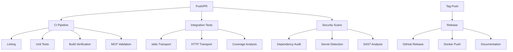

# GitHub Actions CI/CD Guide

## Table of Contents
- [Overview](#overview)
- [Workflow Architecture](#workflow-architecture)
- [Core Workflows](#core-workflows)
  - [CI Pipeline](#ci-pipeline)
  - [Integration Tests & Coverage](#integration-tests--coverage)
  - [Security Scanning](#security-scanning)
  - [Release Automation](#release-automation)
  - [Docker Build & Test](#docker-build--test)
  - [Performance Testing](#performance-testing)
  - [Documentation Generation](#documentation-generation)
  - [Dependency Updates](#dependency-updates)
  - [CodeQL Analysis](#codeql-analysis)
- [Workflow Triggers](#workflow-triggers)
- [Environment Configuration](#environment-configuration)
- [Secrets Management](#secrets-management)
- [Badge Integration](#badge-integration)
- [Troubleshooting](#troubleshooting)

## Overview

The Hurricane Tracker MCP uses a comprehensive GitHub Actions CI/CD pipeline to ensure code quality, security, and automated deployments. All workflows are optimized for Node.js 22.x and containerized deployments.

### Key Features
- 🚀 Automated CI/CD pipeline
- 🔒 Security scanning and vulnerability detection
- 📊 Code coverage analysis (80% threshold)
- 🐳 Multi-platform Docker builds
- 📈 Performance benchmarking
- 📚 Automated documentation
- 🔄 Dependency management
- ✅ Cross-platform testing

## Workflow Architecture



## Core Workflows

### CI Pipeline
**File:** `.github/workflows/ci.yml`  
**Trigger:** Push to main/develop, PRs, manual dispatch  
**Node Version:** 22.x only

#### Jobs:
1. **Lint & Code Quality**
   - ESLint validation
   - TypeScript compilation check
   - Circular dependency detection

2. **Unit Tests**
   - Single Node.js version (22.x)
   - Test execution with verbose reporting
   - Coverage artifact upload

3. **Build Verification**
   - Production build validation
   - Bundle size checking (<10MB warning)
   - Artifact generation

4. **MCP Protocol Validation**
   - stdio transport initialization test
   - Tool schema validation (5 hurricane tools)
   - Protocol compliance check

```yaml
env:
  NODE_VERSION: '22.x'
  PNPM_VERSION: 8
```

### Integration Tests & Coverage
**File:** `.github/workflows/integration-tests.yml`  
**Trigger:** Push to main/develop, PRs, daily schedule (6 AM UTC)  
**Coverage Threshold:** 80%

#### Jobs:
1. **Integration Tests**
   - Matrix testing for stdio/HTTP transports
   - Server lifecycle management
   - Transport-specific validation

2. **Code Coverage Analysis**
   - C8 coverage reporting
   - Threshold enforcement (80%)
   - Codecov integration

3. **Cross-Platform Testing**
   - OS Matrix: Ubuntu, Windows, macOS
   - Smoke test execution
   - Platform-specific validation

4. **API Testing**
   - NOAA/NHC connectivity verification
   - NWS API validation
   - Tool-specific testing

5. **Performance Testing**
   - Startup time measurement (<1000ms)
   - Memory usage analysis (<100MB)
   - Resource optimization validation

### Security Scanning
**File:** `.github/workflows/security.yml`  
**Trigger:** Push to main, PRs, daily schedule (midnight UTC)

#### Security Checks:
1. **Dependency Vulnerability Scanning**
   - npm audit (production dependencies)
   - Critical vulnerability blocking
   - Automated reporting

2. **OWASP Dependency Check**
   - Comprehensive vulnerability database
   - HTML report generation
   - Retired package detection

3. **Secret Detection**
   - TruffleHog scanning
   - GitLeaks validation
   - Verified secrets only

4. **License Compliance**
   - Prohibited license detection (GPL/AGPL/LGPL)
   - License summary generation
   - Compliance enforcement

5. **SAST (Static Application Security Testing)**
   - ESLint security plugin
   - Semgrep analysis
   - TypeScript/Node.js specific rules

6. **Container Security**
   - Trivy vulnerability scanning
   - SARIF report upload
   - Critical/High severity focus

7. **Security Scorecard**
   - OSSF Scorecard analysis
   - Security best practices validation
   - GitHub Security integration

### Release Automation
**File:** `.github/workflows/release.yml`  
**Trigger:** Version tags (v*.*.*), manual dispatch  
**Note:** No NPM publishing (deployable unit only)

#### Release Process:
1. **Prepare Release**
   - Version determination
   - Changelog generation
   - CHANGELOG.md update
   - Version bump commit

2. **GitHub Release Creation**
   - Distribution archives (tar.gz, zip)
   - Release notes with changelog
   - Docker installation instructions
   - Documentation links

3. **Docker Build & Push**
   - Multi-platform builds (amd64, arm64)
   - Docker Hub push
   - GitHub Container Registry push
   - Version tagging

4. **Documentation Update**
   - API documentation generation
   - README badge updates
   - Auto-commit updates

5. **Release Notifications**
   - Summary generation
   - Status reporting
   - Artifact listing

### Docker Build & Test
**File:** `.github/workflows/docker.yml`  
**Trigger:** Push to main/develop (Dockerfile changes), PRs

#### Docker Pipeline:
1. **Build & Test**
   - Docker Buildx setup
   - Container health checks
   - stdio mode validation
   - Vulnerability scanning
   - Image size validation (<500MB)

2. **Multi-platform Build**
   - linux/amd64 and linux/arm64
   - GitHub Container Registry push
   - Metadata extraction
   - Cache optimization

3. **Docker Compose Testing**
   - Service orchestration
   - Volume persistence testing
   - Integration validation
   - Health check scripts

### Performance Testing
**File:** `.github/workflows/performance.yml`  
**Trigger:** Push to main, PRs, weekly schedule (Monday 2 AM UTC)

#### Performance Metrics:
1. **Benchmark Tests**
   - Startup time analysis (10 iterations)
   - 500ms threshold enforcement
   - Memory usage profiling
   - Heap usage limits (50MB)

2. **Tool Execution Benchmarks**
   - Individual tool performance
   - Average/Max time tracking
   - HTTP endpoint testing

3. **Load Testing**
   - Artillery configuration
   - Phased load patterns
   - RPS and latency metrics
   - P50/P95/P99 analysis

4. **Bundle Size Analysis**
   - Distribution size tracking
   - Largest file identification
   - Source map detection
   - Dependency size analysis

### Documentation Generation
**File:** `.github/workflows/docs.yml`  
**Trigger:** Push to main (src/docs changes), manual dispatch

#### Documentation Pipeline:
1. **API Documentation**
   - TypeDoc generation
   - JSDoc processing
   - Dependency graph visualization

2. **Architecture Documentation**
   - PlantUML diagrams
   - Mermaid flowcharts
   - Visual architecture guides

3. **Markdown Processing**
   - Validation and linting
   - Table of contents generation
   - PDF conversion
   - Statistics generation

4. **GitHub Pages Deployment**
   - Static site generation
   - Index page creation
   - Artifact deployment

5. **Wiki Updates**
   - Automated wiki synchronization
   - Documentation mirroring

### Dependency Updates
**File:** `.github/workflows/dependency-update.yml`  
**Trigger:** Weekly schedule (Monday midnight UTC), manual dispatch

#### Update Strategy:
1. **NPM Updates**
   - npm-check-updates integration
   - Security/Minor/Major update options
   - Automated PR creation
   - Test validation

2. **Security-Only Updates**
   - Critical vulnerability patching
   - Forced security fixes
   - Priority PR creation

3. **Docker Base Image Updates**
   - Node.js version tracking
   - Dockerfile updates
   - Build validation

4. **GitHub Actions Updates**
   - Action version checking
   - Update detection
   - Compatibility validation

5. **Weekly Reports**
   - Comprehensive dependency analysis
   - Outdated package listing
   - License summary
   - Issue creation

### CodeQL Analysis
**File:** `.github/workflows/codeql.yml`  
**Trigger:** Push to main/develop, PRs, weekly schedule (Monday noon UTC)

#### Security Analysis:
- JavaScript/TypeScript scanning
- Security and quality queries
- SARIF result upload
- Artifact retention

## Workflow Triggers

| Workflow | Push | PR | Schedule | Manual | Tags |
|----------|------|----|---------:|--------|------|
| CI Pipeline | ✅ | ✅ | - | ✅ | - |
| Integration Tests | ✅ | ✅ | Daily | ✅ | - |
| Security | ✅ | ✅ | Daily | ✅ | - |
| Release | - | - | - | ✅ | ✅ |
| Docker | ✅ | ✅ | - | ✅ | - |
| Performance | ✅ | ✅ | Weekly | ✅ | - |
| Documentation | ✅ | - | - | ✅ | - |
| Dependency Updates | - | - | Weekly | ✅ | - |
| CodeQL | ✅ | ✅ | Weekly | - | - |

## Environment Configuration

### Required Environment Variables
```yaml
NODE_VERSION: '22.x'          # Node.js version
MCP_TRANSPORT: stdio/http     # Transport mode
LOG_LEVEL: error              # Logging level
HTTP_PORT: 8080              # HTTP server port
COVERAGE_THRESHOLD: 80       # Coverage requirement
```

### Build Matrix Configuration
- **Node.js:** 22.x (single version)
- **Operating Systems:** Ubuntu, Windows, macOS
- **Docker Platforms:** linux/amd64, linux/arm64
- **Transports:** stdio, HTTP

## Secrets Management

### Required GitHub Secrets
| Secret | Purpose | Required |
|--------|---------|----------|
| `GITHUB_TOKEN` | GitHub API access | ✅ (automatic) |
| `CODECOV_TOKEN` | Codecov integration | Optional |

**Note:** No Docker Hub credentials needed! The project uses GitHub Container Registry (ghcr.io) which is FREE and uses your existing GitHub token automatically.

### Setting Secrets
1. Navigate to Settings → Secrets and variables → Actions
2. Click "New repository secret"
3. Add secret name and value
4. Save the secret

## Docker Registry Guide - GitHub Container Registry

This project uses **GitHub Container Registry (ghcr.io)** for Docker images. It's FREE for public repositories and integrates seamlessly with GitHub Actions.

### Benefits of GitHub Container Registry

✅ **FREE for public repositories** - Unlimited storage  
✅ **No separate account needed** - Uses GitHub credentials  
✅ **Automatic authentication** - GitHub Actions use GITHUB_TOKEN  
✅ **Better integration** - Links to your repository  
✅ **Fine-grained permissions** - Control via GitHub settings  

### How It Works

#### 1. Automatic Setup
No manual setup required! GitHub Actions automatically:
- Uses `GITHUB_TOKEN` for authentication
- Pushes to `ghcr.io/kumaran-is/hurricane-tracker-mcp`
- Tags images with version numbers

#### 2. Image Naming Convention
```
ghcr.io/[github-username]/[repository-name]:[tag]
ghcr.io/kumaran-is/hurricane-tracker-mcp:latest
ghcr.io/kumaran-is/hurricane-tracker-mcp:v1.0.0
```

#### 3. Pulling Images

##### Public Access (No authentication needed)
```bash
# Pull latest version
docker pull ghcr.io/kumaran-is/hurricane-tracker-mcp:latest

# Pull specific version
docker pull ghcr.io/kumaran-is/hurricane-tracker-mcp:v1.0.0

# Run the container
docker run -it ghcr.io/kumaran-is/hurricane-tracker-mcp:latest
```

### GitHub Actions Configuration

The workflows are already configured to use GitHub Container Registry:

#### Release Workflow
```yaml
- name: Log in to GitHub Container Registry
  uses: docker/login-action@v3
  with:
    registry: ghcr.io
    username: ${{ github.actor }}
    password: ${{ secrets.GITHUB_TOKEN }}
```

#### Docker Workflow
```yaml
env:
  REGISTRY: ghcr.io
  IMAGE_NAME: ${{ github.repository }}
```

### Making Your Package Public

After the first push, make your package public:

1. Go to your GitHub profile → Packages
2. Find `hurricane-tracker-mcp`
3. Click on Package settings
4. Scroll to "Danger Zone"
5. Click "Change visibility" → Make public

### Viewing Your Packages

1. Visit: `https://github.com/kumaran-is?tab=packages`
2. Or go to repository → Packages (right sidebar)
3. Click on the package to see all versions

### Container Registry URLs

- **Registry:** `ghcr.io`
- **Package URL:** `https://github.com/kumaran-is/hurricane-tracker-mcp/pkgs/container/hurricane-tracker-mcp`
- **Pull Command:** `docker pull ghcr.io/kumaran-is/hurricane-tracker-mcp:latest`

### No Docker Hub Needed!

This project doesn't require Docker Hub at all. GitHub Container Registry provides everything needed:
- Free hosting for public images
- Automatic builds via GitHub Actions
- Version management
- Security scanning

### Alternative: Docker Hub (Optional)

If you want to ALSO publish to Docker Hub:

#### 1. Create Docker Hub Account
- Visit [hub.docker.com](https://hub.docker.com)
- Sign up for free account
- Verify email

#### 2. Create Access Token
- Go to Account Settings → Security
- Click "New Access Token"
- Name: `github-actions`
- Permissions: `Read, Write, Delete`
- Copy the token (shown once only!)

#### 3. Add GitHub Secrets
- Repository Settings → Secrets → Actions
- Add `DOCKER_USERNAME`: Your Docker Hub username
- Add `DOCKER_PASSWORD`: The access token from step 2

#### 4. Update Workflows (if needed)
```yaml
- name: Log in to Docker Hub
  uses: docker/login-action@v3
  with:
    username: ${{ secrets.DOCKER_USERNAME }}
    password: ${{ secrets.DOCKER_PASSWORD }}
```

### Recommendations

✅ **Use GitHub Container Registry** - It's free and integrated  
⚠️ **Docker Hub is optional** - Only if you need wider distribution  
✅ **Make packages public** - After first successful push  
✅ **Use semantic versioning** - For clear version management  

### Troubleshooting

#### Permission Denied
If you see permission errors:
1. Ensure repository has package write permissions
2. Settings → Actions → General → Workflow permissions
3. Select "Read and write permissions"

#### Package Not Visible
1. Check if workflow ran successfully
2. Go to Actions tab → Look for Docker workflow
3. Package appears after first successful push

#### Image Pull Error
```bash
# If private, authenticate first:
echo $GITHUB_TOKEN | docker login ghcr.io -u USERNAME --password-stdin

# Then pull
docker pull ghcr.io/kumaran-is/hurricane-tracker-mcp:latest
```

## Troubleshooting

### Common Issues

#### 1. CI Pipeline Failures
**Issue:** ESLint or TypeScript compilation errors
```bash
# Local validation
npm run lint
npx tsc --noEmit
```

#### 2. Coverage Threshold Not Met
**Issue:** Coverage below 80%
```bash
# Check coverage locally
npm run test:coverage
npx c8 report --reporter=text
```

#### 3. Docker Build Failures
**Issue:** Image size exceeds limit
```bash
# Analyze image size
docker images hurricane-tracker-mcp:test --format "table"
docker history hurricane-tracker-mcp:test
```

#### 4. Security Vulnerabilities
**Issue:** npm audit failures
```bash
# Fix vulnerabilities
npm audit fix
npm audit fix --force  # Use with caution
```

#### 5. Release Workflow Issues
**Issue:** Version tag format incorrect
```bash
# Correct format
git tag v1.0.0
git push origin v1.0.0
```

### Debugging Workflows

1. **Enable Debug Logging**
   - Add secret: `ACTIONS_RUNNER_DEBUG: true`
   - Add secret: `ACTIONS_STEP_DEBUG: true`

2. **Re-run with Debug**
   - Click "Re-run jobs" → "Re-run all jobs"
   - Check debug logs in workflow run

3. **Local Testing**
   ```bash
   # Install act for local testing
   brew install act  # macOS
   
   # Run workflow locally
   act -W .github/workflows/ci.yml
   ```

### Performance Optimization

1. **Cache Optimization**
   - Ensure package-lock.json is committed
   - Use appropriate cache keys
   - Monitor cache hit rates

2. **Parallel Job Execution**
   - Independent jobs run in parallel
   - Use job dependencies wisely
   - Optimize job matrices

3. **Artifact Management**
   - Clean up old artifacts
   - Use retention policies
   - Compress large files

## Best Practices

1. **Workflow Design**
   - Keep workflows focused and modular
   - Use reusable workflows where applicable
   - Implement proper error handling

2. **Security**
   - Never commit secrets
   - Use GitHub Secrets for sensitive data
   - Regularly update dependencies

3. **Testing**
   - Test workflows in feature branches
   - Use workflow_dispatch for manual testing
   - Validate changes locally first

4. **Documentation**
   - Keep workflow files well-commented
   - Document custom scripts
   - Maintain this guide updated

5. **Monitoring**
   - Set up notifications for failures
   - Monitor workflow run times
   - Track success rates

## Resources

- [GitHub Actions Documentation](https://docs.github.com/en/actions)
- [Workflow Syntax Reference](https://docs.github.com/en/actions/reference/workflow-syntax-for-github-actions)
- [GitHub Actions Marketplace](https://github.com/marketplace?type=actions)
- [Act - Local GitHub Actions](https://github.com/nektos/act)